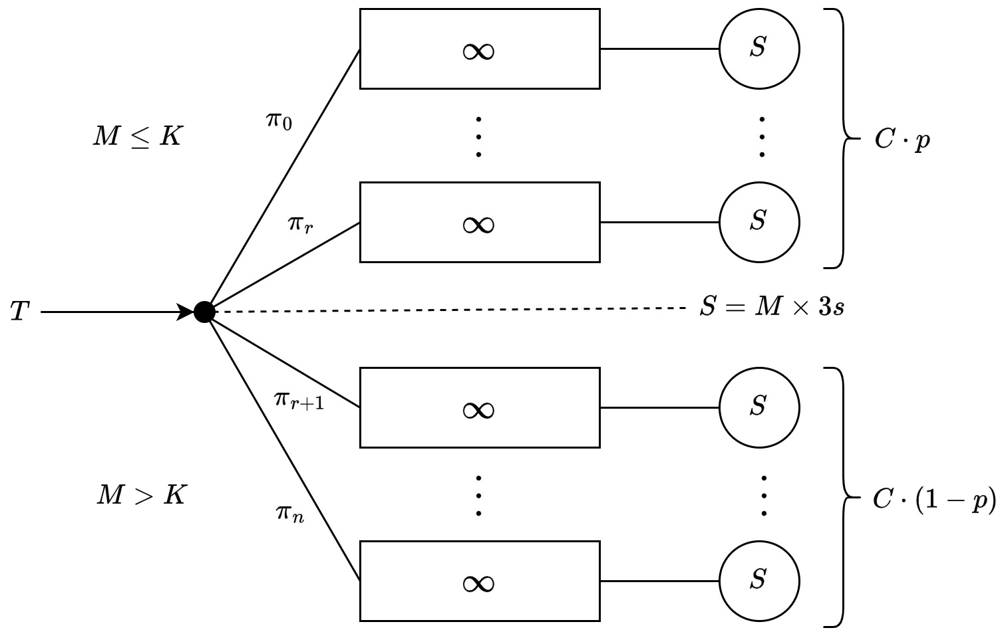

# A PECSN' project

## Description

## Objectives

Analizzare il comportamento delle code sia in termini di dimensioni che in termini di tempo di attesa per 
ogni cliente.

Dimostrare che, allo Steady State, gli indici di performance di un sistema che implementa la policy di join the shortest queue (dynamic load balancing) tendono a quelli in cui la probabilità di routing è equa per ogni nuovo arrivo (i.e. 1/numero code), al variare di p e K.

## Key Performance Indices (KPIs)

### Main
The main objectives of this study are comparing the:
- Waiting time per la singola coda ed anche riferito ai due sottosistemi
- Numero medio della dimensione di code nel sottosistema delle code veloci e in quello delle code normali
- il Throughput

### Other KPIs
- routing probability inside the two subsystems
- Utilizzazione del sistema complessivo

## Model
Come si può vedere dal modello disegnato, il sistema che viene considerato all'interno delle specifiche viene schematizzato come vari sottosistemi M/M/1 in parallelo. Nello specifico possiamo distinguere due sottoinsiemi composti da SCs diversi, il primo riservato ai clienti con M<=K oggetti definito "Casse Veloci" ed il secondo atto ad accogliere tutti gli altri clienti (i.e. M>K).
La percentuale di casse viene suddivisa tra i due sottosistemi secondo al parametro p, che va ad indicare la percentuale di casse veloci rispetto al totale di casse del sistema.

### Assumptions
All'interno delle assunzioni bisogna nominare le seguenti:

- La dimensione delle code è infinita e le persone mettendosi in coda non possono superare la gente di fronte a loro (FIFO).
- Non è possibile abbandonare una coda una volta che ci si è entrati
- Un cliente con pochi oggetti può solamente accodarsi in code veloci
- La probabilità di routing all'interno dei due sottosistemi individuati è equa (1 / numero di casse del sottosistema). E' da dimostrare che tale static load balancing perfetto porti ad una situazione simile a quella che si avrebbe in caso di dynamic load balancing, ove il cliente venga instradato nella coda con il numero minore di persone in coda.
- All'interno di una simulazione non è possibile modificare il numero p di casse veloci nè tantomeno vengono aggiunte nuove casse sotto situazioni di carico intenso.
- Idle time in caso di coda piena è pari a 0. Il cassiere inizia subito a servire il prossimo cliente nella coda (se presente) dopo la partenza del precedente cliente

Considerando le assunzioni sopra indicate è possibile formalizzare le probabilità $\pi_i$ che compaiono nella Figura X relativa al modello:
Ipotesi:
- Lo stato del sistema corrisponde con il numero di clienti in coda.
- $C$ numero di casse complessivo del sistema
- $p$ percentuale di casse veloci
- $(1-p)$ percentuale di casse normali
- $C\cdot p$ numero di casse veloci all'interno del sistema
- $C\cdot (1-p)$ numero di casse normali
- $\alpha(K) = P\{ M\leq K\}$ probabilità che un cliente abbia meno, o al più, K oggetti e conseguentemente esprime la probabilità di un cliente di essere routato sul primo sottosistema.

A questo punto possiamo scrivere che:

$$\left\{\begin{matrix}
 \pi_i = \frac{\alpha}{C\cdot p} & \ \ 0\leq i \leq r \\[10pt] 
 \pi_j = \frac{(1-\alpha)}{C\cdot (1-p)} & \ \ r+1\leq j \leq n
\end{matrix}\right.$$

## Validation
AKA Common Sense Validation:
Prima di passare all'implementazione del modello teorico bisogna cercare di validare il modello considerando un sistema reale. E' chiaro che considerando un qualsiasi supermercato (tranne il CarreFour di Lucca) risulta che le assunzioni fatte non sono poi così drastiche perché:

1. Anche in un sistema reale succede che la dimensione delle code in un supermercato non ha un limite prefissato, infatti i clienti potrebbero accodarsi all'interno di tutte le corsie in cui vengono venduti i prodotti. In più i clienti seguono una policy FIFO perché il cliente che si è messo per primo in fila difficilmente farà passare altra gente di fronte a lui.
2. Una volta che una persona è in fila con i propri oggetti nel carrello non lascerà mai il carrello pieno ed uscirà dal supermercato.
3. Se un cliente ha pochi oggetti preferirà sempre andare nelle code veloci per sbrigarsi prima.

****
- La probabilità di routing all'interno dei due sottosistemi individuati è equa (1 / numero di casse del sottosistema). E' da dimostrare che tale static load balancing perfetto porti ad una situazione simile a quella che si avrebbe in caso di dynamic load balancing, ove il cliente venga instradato nella coda con il numero minore di persone in coda.
****

5. Consideriamo solamente il caso a regime (in cui tutte le casse del supermercato sono già aperte ed è impossibile creare una nuova cassa perché non esiste) di un supermercato in cui non vengono aperte nuove casse (e nemmeno chiuse).
6. Se il cassiere ha clienti in fila non si ferma per prendersi una pausa.

## Factors
Considering the factors here we have:

- p: percentage of quick-checkout tills;
- K: maximum number of items that a customer can have in his (her) cart to be served in a quick-checkout till;
  
## Parameters
When we consider the parameters we have:

- $C$ total number of tills;
- Distribution of the inter-arrival time of customers:
  - Exponential:
    - rate T;
- Distribution of the number of items in a customer's cart:
  - Exponential:
    - rate M;
  - Lognormal:
    - mean M;
    - standard deviation $\sigma$;

## Simulation Tool
The simulation tool used for this project is Omnet++. 

## Implementation
To implement the theoretical model we will consider the following modules:

- **Source**: generates customers according to the inter-arrival time distribution;
- **Local-Sink**: represents a till;
- **Queue**: represents the queue of a till;
- **Global-Sink**: collects statistics about the simulation run.
- **LoadBalancer**: represents the load balancer that routes the customers to the two subsystems.

## Verification of the Implemented Simulation Model

## Factors Calibration

## Experiments Design

## Simulation Run

## Results Analysis

## Conclusions

# Other

## Parameters
- T Distribution
- M Distribution
- A (pAtience) Distribution
- Total number of tills

## Factors
- p: percentage of quick-checkout tills, where a customer can be served if his (her) cart holds less than K items;
- K **ask to Prof. Nardini if it is a Factor instead, because the text it isn't clear enough**.

## Osservazioni ITA
La lognormale essendo solo positiva si presta a quelle cose che valgono solo per distribuzioni positive.

Quando andremo a vedere il load balancing dinamico ci potrà tornare utile per la questione del nodo di bilanciamento relativo ai due sottosistemi M/M/C che compongono il nostro sistema completo.
Avremo in ingresso a ciascun sottosistema un certo inter-arrival time funzione di T, K e tipo di distribuzione che ha T.

Classifier in Omnet++ per nodo probabilistico.

